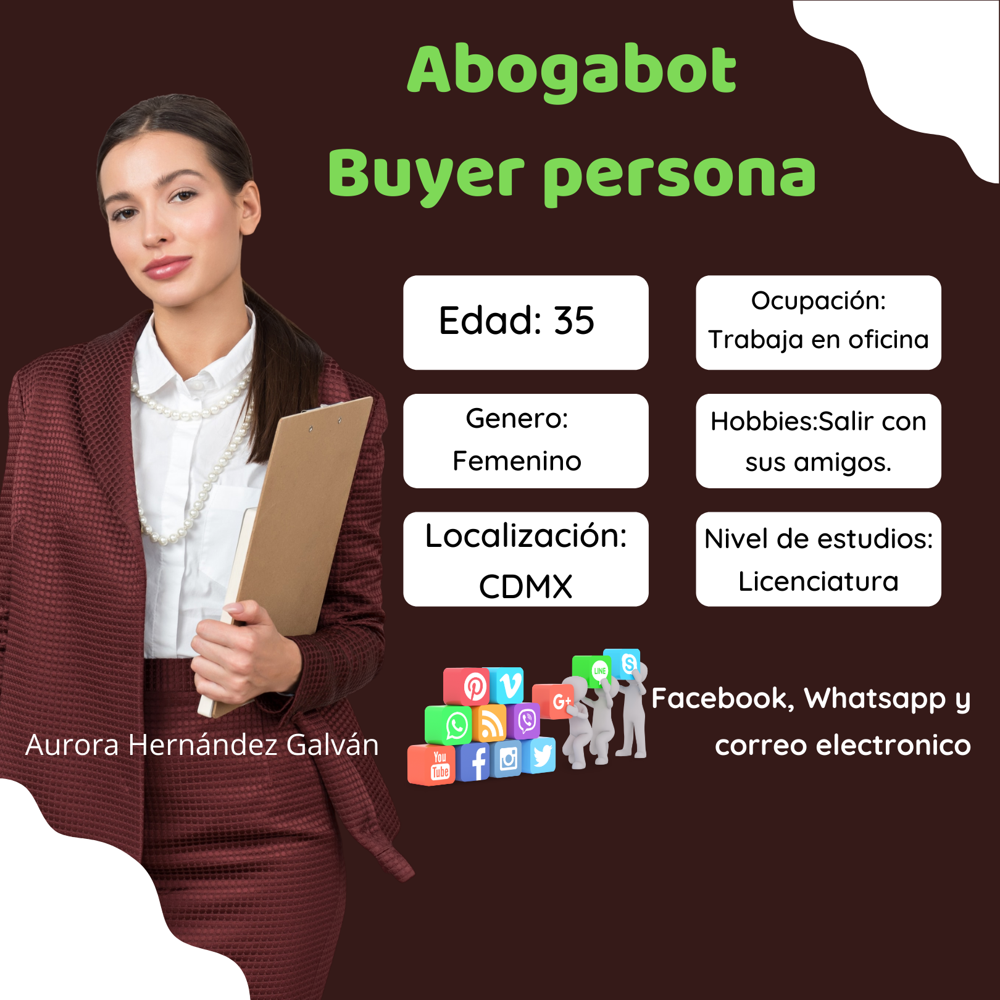
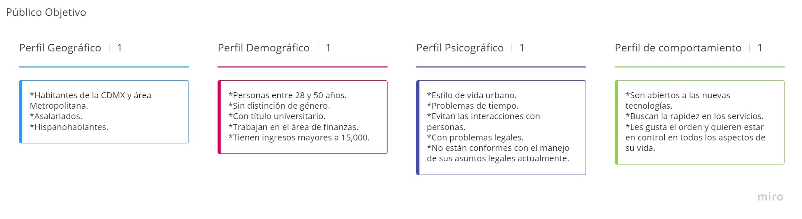

# Practicas de Intro a Frontend

Caso: Abogabot

## Requerimientos para el desarrollo de una solución.
### Datos
-Solicitante de la solución: Abogabot
-Giro: Despacho de abogados
-Tipo de solución: Sitio web

### Requerimientos generales
-Colores preferidos: azul marino y blanco
-Responsiva
-Diseño también para verse en móvil.
#### Para cliente de Abogabot
-Formulario para solicitar demanda
-Sistema de pago
-Cuenta en la plataforma
-Actualizaciones/notificaciones del estado del proceso solicitado en plataforma y por e-mail.
#### Para Abogabot
-Recibir notificación de nueva demanda y generación automática de documento de plantilla (.doc) con los datos del formulario
-Un dashboard donde puede ver todos los pagos
-Es quien actualiza proceso de demanda y puede agregar comentarios

---

## Buyer persona

Hecho con [canva](https://www.canva.com)
---

## Publico objetivo

Hecho con plantilla de [Miro](https://miro.com/es/plantillas/publico-objetivo/)
---

## Wireframe UX

---

## UI